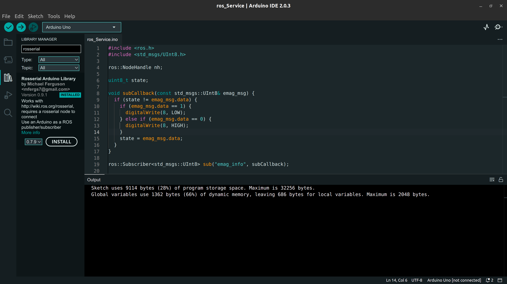

# Arduino Code for Emagnet Actuator

1. Install the suitable version of ros according to your distro.

2. Install [Arduino IDE](https://www.arduino.cc/en/software) linux Appimage from the official website. 

3. Install `ros-noetic-rosserial` and `ros-noetic-rosserial-arduino` 

   ```bash
   sudo apt-get install -y ros-noetic-rosserial ros-noetic-rosserial-arduino
   ```

4. Connect Arduino via USB. (The device is usually detected as `/dev/ttyACM0`)

5. Open the `.ino` file in Arduino IDE. 

6. Open Library Manager in IDE and search `rosserial` and install the first available package. 

7. Next Include the Library to your sketch.
   

8. Build the code. (As of now it has the following build error) 

   ```bash
   #include <cstring> not found (something similar)
   ```

   edit the file `~/Arduino/libraries/Rosserial_Arduino_Library/src/ros/msg.h` replace `cstring` with `String.h` and replace `std::memcpy` with `memcpy` 

9. Build and upload after replacing the text. It should build successfully. [Google otherwise ;)]

10.  On a terminal run `roscore`

11. On another terminal run (double check in Arduino IDE to which port it is connected)

    ```bash
    rosrun rosserial_python serial_node.py /dev/ttyACM0
    ```

12. By default it subscribes to the topic `/emag_switch`

13. Switch the electromagent by publishing on this topic by (`0` for off and `1 ` for on)

    ```bash
    rostopic pub /emag_info std_msgs/UInt8 "data: 0"
    ```

    